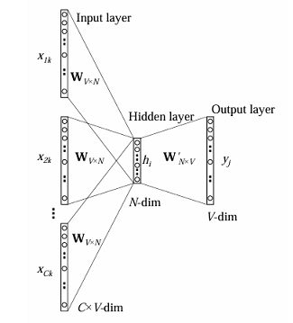
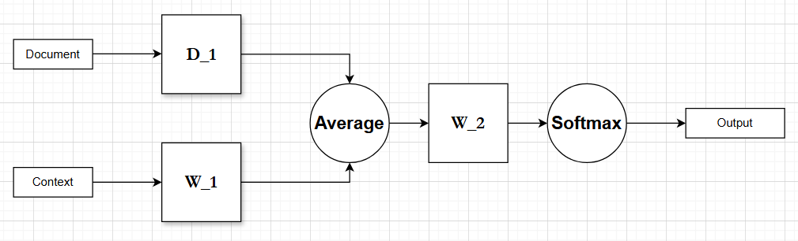

# Recherche d’offres par IA

## Objectif

Afin de proposer des offres d’emploi plus personnalisées, nous avons mis en place une approche basée sur des **représentations vectorielles de documents**. L’objectif est de projeter à la fois les **offres** et les **CV** dans un même espace d’embedding, puis de mesurer leur similarité afin de recommander les offres les plus pertinentes à chaque candidat.

Pour cela, nous utilisons le modèle **Doc2Vec**, dont le papier original est disponible sur ce dépôt GitHub : [https://github.com/jhlau/doc2vec](https://github.com/jhlau/doc2vec).

---

## Rappel : modèle CBOW

Doc2Vec s’appuie sur une extension du modèle **CBOW (Continuous Bag of Words)**.

Dans CBOW :

* Plusieurs mots de contexte, encodés en *one-hot*, sont fournis en entrée.
* Chaque vecteur *one-hot* est multiplié par une matrice de projection (W_1), produisant des embeddings de mots.
* Ces embeddings sont moyennés pour obtenir un vecteur noté (h).
* Le vecteur (h) est ensuite multiplié par une matrice (W_2).
* Une fonction **softmax** est appliquée afin d’obtenir une distribution de probabilité sur le vocabulaire.

Le modèle est entraîné à prédire un **mot cible** à partir d’un **contexte** (généralement constitué des (k) mots entourant ce mot cible).

---

## Extension Doc2Vec

Doc2Vec étend CBOW en introduisant une représentation explicite du **document**.

Concrètement :

* Une matrice supplémentaire (D_1), parallèle à (W_1), est ajoutée.
* Le document est encodé en *one-hot* puis projeté via (D_1) pour obtenir un vecteur représentant le document.
* Ce vecteur est intégré à la moyenne des embeddings de mots afin de calculer le vecteur (h).

Ainsi, le modèle apprend simultanément :

* des représentations de mots,
* des représentations de documents (offres ou CV).

---

## Entraînement du modèle

Le modèle Doc2Vec a été entraîné sur l’ensemble de nos **offres d’emploi** afin d’apprendre un espace d’embedding personnalisé.

Pour chaque offre, les champs suivants ont été concaténés dans une unique chaîne de caractères :

* `intitule_poste`
* `education`
* `competences`
* `experience`

Cette concaténation permet de fournir au modèle une synthèse de chaque offre.

---

## Projection des CV et recommandation

Une fois l’espace d’embedding appris :

1. Les CV sont projetés dans cet espace à l’aide du modèle Doc2Vec.
2. Une **cosine similarity** est calculée entre chaque CV et l’ensemble des offres.
3. Les **5 offres présentant les scores de similarité les plus élevés** sont sélectionnées.
4. Ces offres sont ensuite proposées à l’utilisateur dans l’application.

---

## Extraction des informations des CV

Pour le scraping des informations contenues dans les CV, nous utilisons la librairie **PyPDF2**.

Cette solution donne de bons résultats pour des CV :

* structurés de manière linéaire,
* générés à partir de formats classiques.

En revanche, les CV conçus avec des outils graphiques (par exemple **Canva**) sont plus difficiles à exploiter correctement.

---

## Limites de l’approche

Malgré son efficacité, cette méthode présente plusieurs limites :

* **Absence de traduction automatique des offres**
  La qualité de l’espace d’embedding dépend fortement de la répartition des langues dans la base de données.

* **Absence de nettoyage avancé des CV scrapés**
  Les CV à structure graphique complexe (type Canva) sont pénalisés.

* **Description complète de l’offre non utilisée**
  L’entraînement ne prend pas en compte le champ description détaillée, ce qui peut limiter la finesse de la discrimination entre certaines offres.

---

## Code

Pour notre application, nous avons créé un fichier my_classes contenant deux classes : **Doc2VecTrainer** et **CVMatcher**. La première, Doc2VecTrainer, s’occupe d’entraîner notre modèle, tandis que la seconde, CVMatcher, extrait les informations du CV (comme décrit précédemment) et calcule les scores de similarité avec les offres.

Le fichier <code>train_model.py</code> entraîne le modèle en utilisant **Doc2VecTrainer** et l’exporte dans un fichier model. De son côté, <code>server.R</code> utilise **CVMatcher** pour calculer les scores de similarité à partir du CV fourni en entrée.
